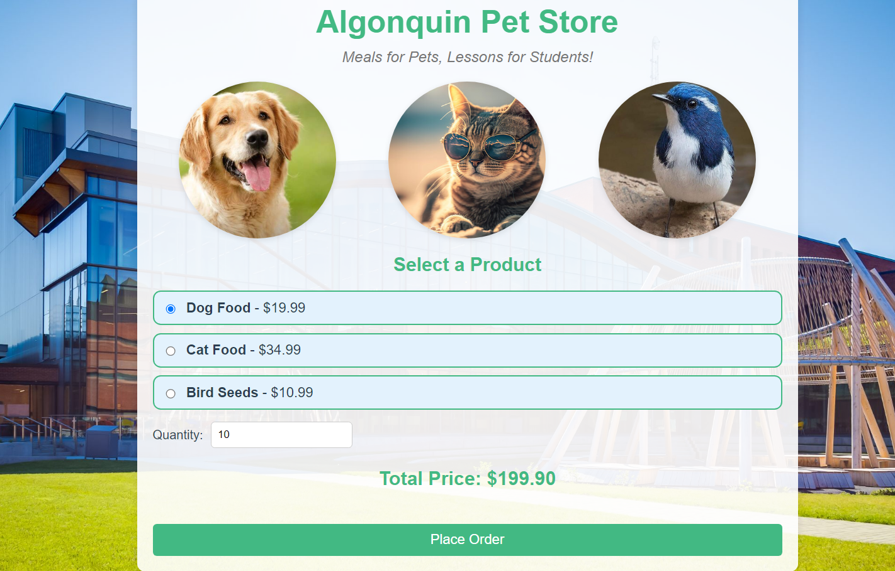

# Algonquin Pet Store

Welcome to the **Algonquin Pet Store** application. 

The Algonquin Pet Store is a full-stack web application. It consists of a Vue.js store-front, Node.js order-service, Rust-based product-service, and RabbitMQ for message brokering. These components work together to create a microservices architecture.

## Table of Contents

1. [Architecture Overview](#architecture-overview)
2. [Setup](#setup)
   - [RabbitMQ](#rabbitmq) 
   - [Order Service](#order-service)
   - [Product Service](#product-service)
   - [Store-Front](#store-front)
3. [Running the Full Application](#running-the-full-application)

---

## Architecture Overview

This Algonquin Pet Store application is built using a microservices architecture with the following components:

- **Store Front (Vue.js)**: A front-end application where customers can browse and order products.
- **Order Service (Node.js)**: Manages customer orders and interacts with RabbitMQ for message queuing.
- **Product Service (Rust)**: Handles product listings. Manages product details and inventory.
- **RabbitMQ**: Message broker for communication between services. Used to queue orders for processing.
## Setup
### RabbitMQ

Follow the instructions in the [RabbitMQ README](RabbitMQ/README.md) to get RabbitMQ running locally.

### Order-Service

Navigate to the `order-service` folder and follow the instructions in its [Order-Service README](order-service/README.md).

### Product-Service

Navigate to the `product-service` folder and follow the instructions in its [Product-Service README](product-service/README.md).

### Store-Front

Navigate to the `store-front` folder and follow the instructions in its [Store-Front README](store-front/README.md).

## Running the Full Application

Once you have all the services running:

- Visit the store-front on http://localhost:8080
- The store-front communicates with the product-service and order-service
- Orders are sent to RabbitMQ for processing

